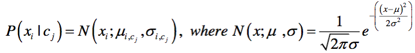
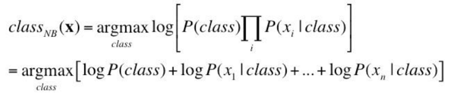
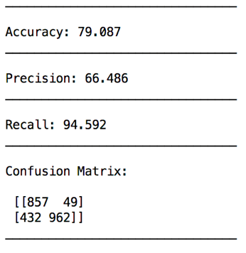

# Email-Spam-Classification

This project involved the implementation of Gaussian Naïve Bayes to classify the Spambase data from the UCI ML repository (https://archive.ics.uci.edu/ml/datasets/spambase). 

The dataset contains 4601 examples which were split into training and test sets having around 2301 and 2300 instances respectively with roughly 40% spam and 60% non-spam data to reflect the statistics of the full dataset. 
Since each feature is assumed to be independent, no standardization of features is required.

A probabilistic model was created using the training set, by first computing the prior probability for each class – spam and non-spam. Then, given each class, for each of the 57 features, mean and standard deviation were computed. Standard deviation values of zero were replaced by 0.0001 to avoid divide-by-zero error.

Gaussian Naïve Bayes algorithm was then used to classify test set instances using:

  

Since we have a large no. of features, the product of all probabilities will be very small. To get around this, the log of the product is used instead.

  

The following results were obtained on the test set:

  

Precision, recall and accuracy were computed as follows:

    Precision = (TP * 100) / (TP + FP)
    Recall = (TP * 100) / (TP + FN)
    Accuracy = ((TP + TN) * 100) / (TP + TN + FP + FN)

    where TP: true positives, FP: false positives, TN: true negatives, FN: false negatives.

Since the recall (94.592%) is very high compared to precision (66.486%), it is seen that we have high false positives and low false negatives, i.e. more of non-spam instances are being incorrectly classified as spam, and fewer spam instances are being incorrectly classified as non-spam. This results in an overall accuracy of 79.087%.  
